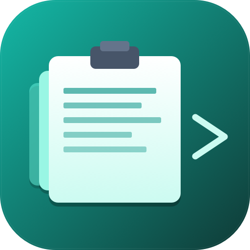

# Redge — Clipboard & Calculator

> A gesture-triggered clipboard manager for macOS. Slide your cursor into the right edge — the panel slides in. Move away — it hides. No window to manage, no Dock icon, no app to babysit.

Bonus: it OCRs your screenshots so you can search inside images, has a built-in calculator with unit converter, and can auto-paste into the app you were just in.


<!-- Replace docs/hero.png with a real screenshot once you've taken one. -->

---

## Features

| | |
|---|---|
| **Edge trigger** | Cursor → right edge (vertical center) → panel slides in. Move off → hides. |
| **Global hotkey** | `⌃⌘V` toggles the panel from anywhere. Auto-focuses the search field. |
| **Text + images** | Captures both. Image rows show a thumbnail and dimensions. |
| **OCR search** | Every image gets OCR'd by Vision in the background. Search matches text *inside* screenshots. |
| **Pin items** | Hover any row → pin icon. Pinned items survive Clear and never expire. |
| **Notes** | Bookmark a Temp row to move it into persistent Notes. Notes never expire. |
| **Copy time** | Each row shows when it was copied — time today, date otherwise. |
| **Drag in / out** | Drop images or text onto the panel. Drag any row out into Mail / Notes / Slack / Figma. |
| **Auto-paste** | Optional: click an item → simulates `⌘V` into the previously-focused app. Requires Accessibility. |
| **Calculator** | Basic 4-function calc with running expression line and 20-entry history. Full keyboard input (digits, `+ - * / =`, Enter, Backspace, Escape). Click any history row to recall. |
| **Unit converter** | Length, weight, temperature, file size. |
| **Persistent history** | Text, images, OCR text, and pin state saved to disk and restored on launch. |
| **Password-aware** | Skips items copied by 1Password / Bitwarden / Keychain. |
| **Launch at Login** | Toggle from the menu-bar icon (`SMAppService`). |
| **Menu-bar only** | No Dock icon, no app switcher clutter. |

---

## Install

Requires macOS 13+ and Xcode Command Line Tools (`xcode-select --install`).

```bash
git clone https://github.com/Ujdasingh/REDGE---CLIPBOARD-CALCULATOR-.git
cd REDGE---CLIPBOARD-CALCULATOR-
./build-app.sh
mv Redge.app /Applications/
open /Applications/Redge.app
```

The build script generates the icon, builds the binary, ad-hoc signs the bundle, and attaches a custom icon attribute via `NSWorkspace.setIcon` (Finder reads this directly — no daemon caching to fight).

### Share as a DMG

To build a disk image you can send to others (drag **Redge.app** → **Applications**):

```bash
./create-dmg.sh
```

Output: `Redge-1.0.dmg` in the project folder. Recipients open the DMG and drag the app to Applications.

If you already built the app and only need to repackage:

```bash
SKIP_BUILD=1 ./create-dmg.sh
```

Because the app is ad-hoc signed, recipients may need **System Settings → Privacy & Security → Open Anyway** on first launch, or right-click → **Open**.

---

## Usage

| Action | How |
|---|---|
| Open panel | Cursor → right edge, vertical center. Or `⌃⌘V`. |
| Hide panel | Move cursor off. Or `⌃⌘V` again. |
| Pin panel open | Pin icon top-right of the panel. Disables auto-hide. |
| Copy an item | Click the row. |
| Pin an item | Hover row → pin icon. Pinned items sort to top. |
| Open a URL | Hover URL row → arrow icon. |
| Delete an item | Hover row → X icon. |
| Clear history | Trash icon in the search bar (keeps pinned). |
| Search | Type in the search field. Matches text *and* image OCR. |
| Drop in | Drag images/text onto the panel. |
| Drag out | Drag a row into another app. |
| Calculator | Click the **Calculator** tab at the top. |
| Recall calc result | Click any row in the calc history. |

---

## Permissions

Redge does not phone home. Data lives in `~/Library/Application Support/Redge/`.

Optional permissions:
- **Accessibility** — only when you enable Auto-paste (simulates `⌘V`).
- **Login Items** — only when you enable Launch at Login.

Clipboard polling, hotkey, edge detection, and OCR all work with **zero permissions**.

---

## Architecture

Swift Package, ~1500 LOC.

```
Sources/Redge/
├── main.swift              — entry; sets .accessory activation policy
├── AppDelegate.swift       — orchestrator: status item, mouse polling, hotkey
├── ClipboardManager.swift  — pasteboard polling, OCR, search, dedup, persistence
├── ClipboardWindow.swift   — NSPanel + SwiftUI panel view, drag/drop, info popover
├── Calculator.swift        — calc state machine + converter + history
├── Persistence.swift       — JSON + image-blob store
├── HotKey.swift            — Carbon RegisterEventHotKey wrapper
└── AutoPaste.swift         — CGEvent ⌘V synthesis + Accessibility prompt
```

Plus `gen_icon.swift` (draws the icon programmatically with `NSBezierPath`) and `set_bundle_icon.swift` (attaches the custom icon via `NSWorkspace.setIcon`).

---

## License

[MIT](LICENSE)
